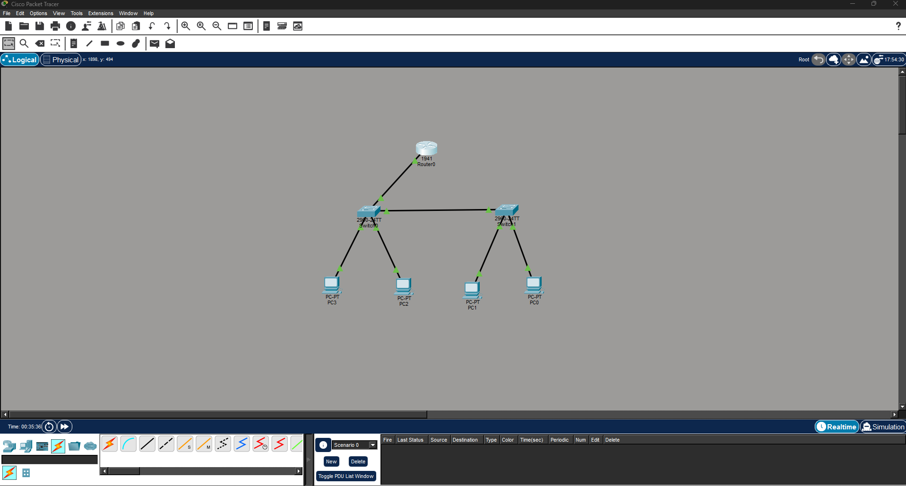
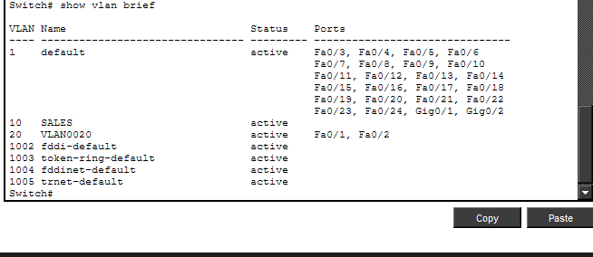
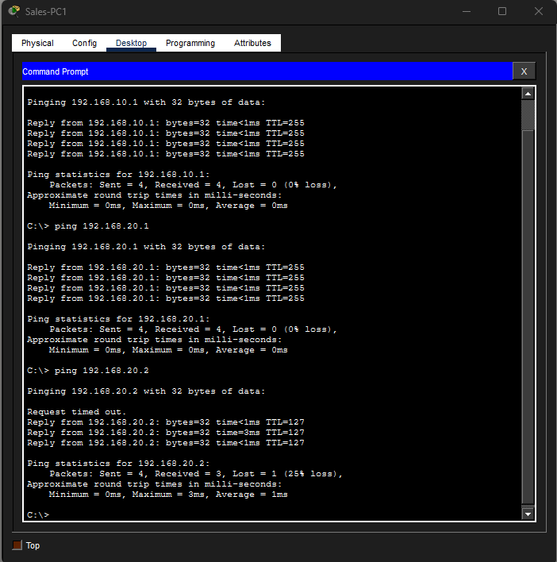

# 🖧 Network Setup and Communication Lab

## 📌 Overview
This lab demonstrates the design and implementation of a segmented network using VLANs, trunking, and inter VLAN routing in Cisco Packet Tracer. The network was structured to separate HR and Sales departments using VLAN 20 and VLAN 10, reducing broadcast domains and improving traffic management. Trunk links were configured between switches using IEEE 802.1Q encapsulation to carry multiple VLANs across a single interface. Inter VLAN communication was achieved using a router on a stick configuration, where subinterfaces were assigned to each VLAN with appropriate gateway addressing. End to end connectivity was verified through ICMP testing, confirming correct VLAN assignment, trunk configuration, and successful routing between networks.

---

## 🧱 Network Topology

This topology represents a small enterprise network consisting of two switches and one router. End devices are grouped into two departments, HR and Sales, each connected to separate access ports on the switches.
A trunk link connects the switches to allow VLAN traffic to pass between them, while the router is connected to one switch to perform inter-VLAN routing.

---

## ⚙️ VLAN Configuration

VLANs were configured to logically separate network traffic between departments. VLAN 10 was assigned to Sales and VLAN 20 to HR. 
Switch ports were configured as access ports and assigned to their respective VLANs, while trunk ports were configured using IEEE 802.1Q to carry multiple VLANs between switches and the router.

---

## 🌐 Connectivity Testing

Connectivity between devices was verified using ICMP ping tests. 
Devices within the same VLAN were able to communicate directly, while communication between different VLANs was successfully achieved through inter-VLAN routing on the router. 
Minor packet loss during initial tests was observed due to ARP resolution, after which stable communication was established.
