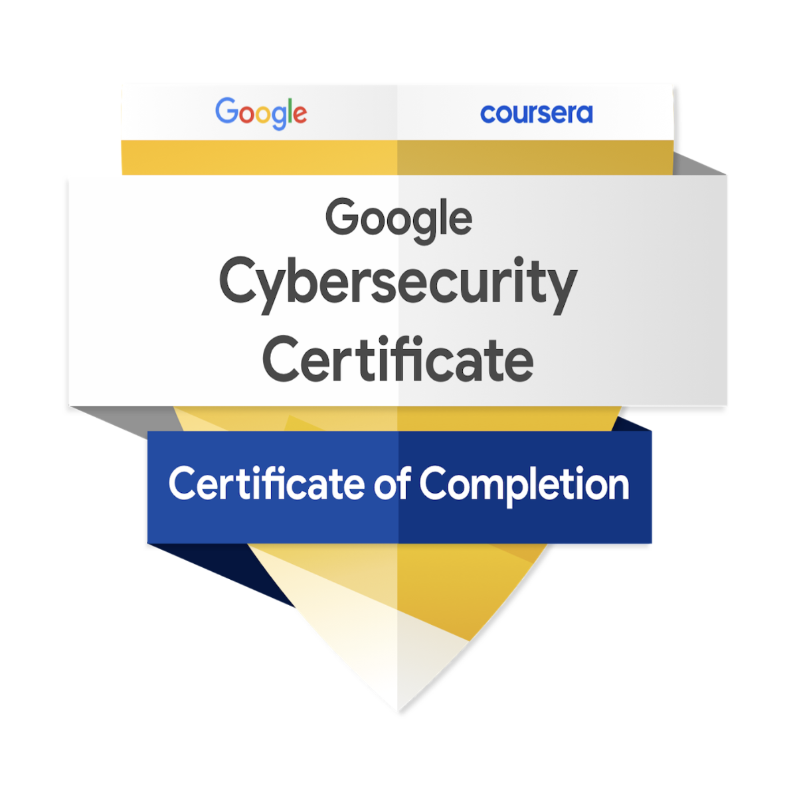
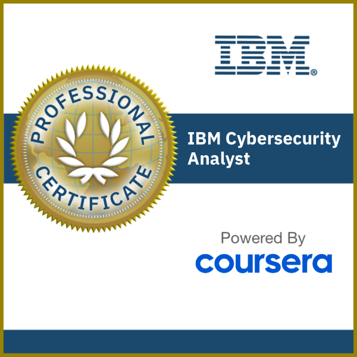
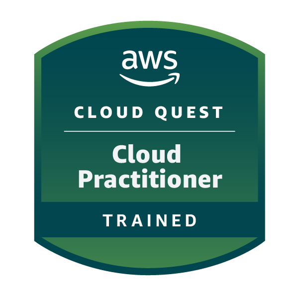
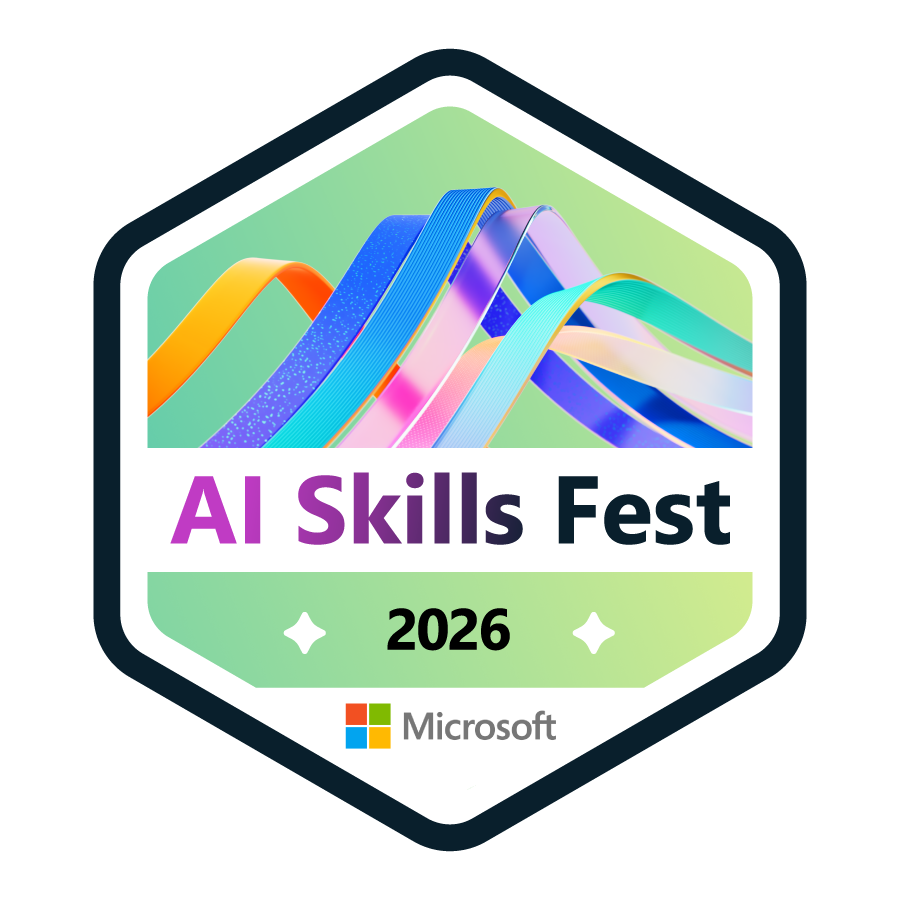
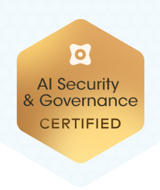
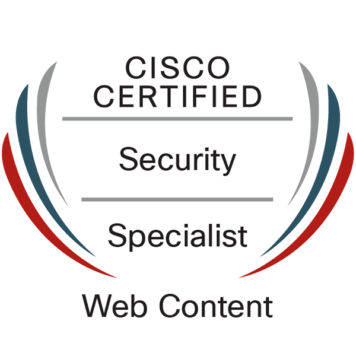
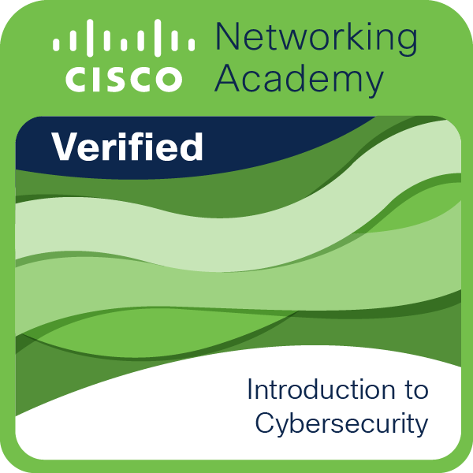
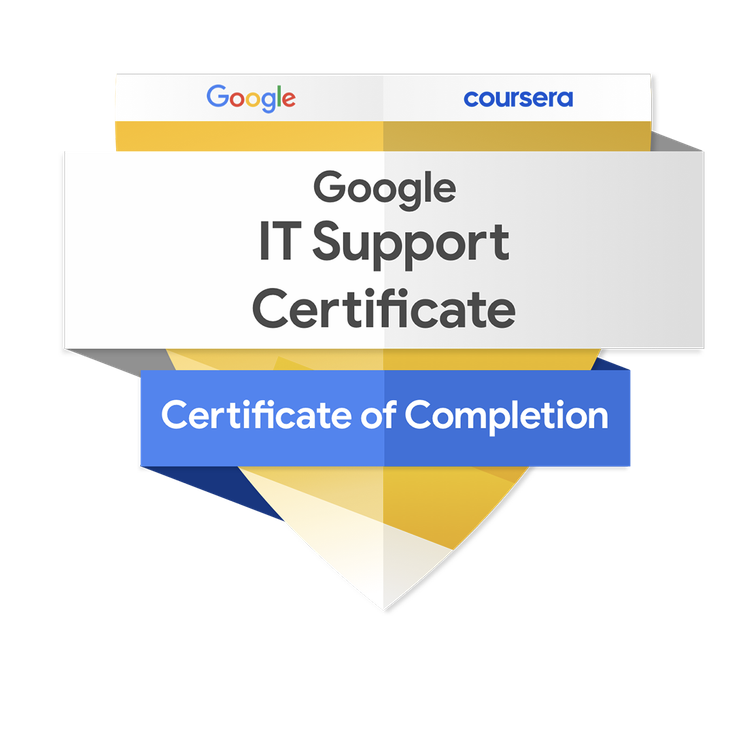
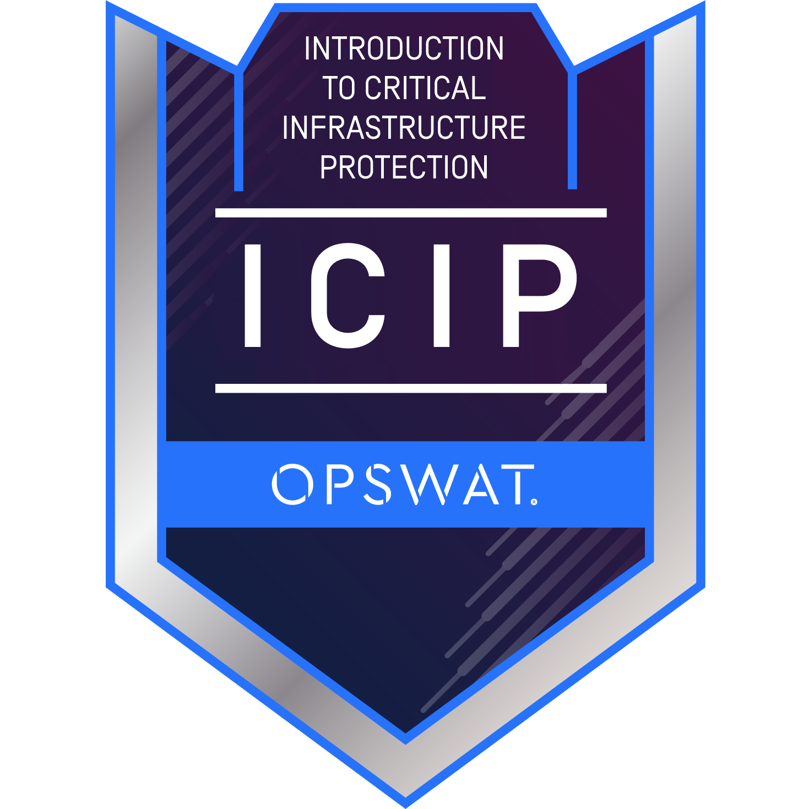

  

<h1 align="center">Hi, I'm Hadi 👋</h1>

<h3 align="center">
Cybersecurity • Cloud Security • DevSecOps

  
  &nbsp;
  
  &nbsp;
  
  &nbsp;
  
  &nbsp;
  
  &nbsp;
  
  &nbsp;
  
  &nbsp;
  
  &nbsp;
  

</h3>

Building secure infrastructure through hands-on cybersecurity, cloud, and DevSecOps projects.

  

  

---

# 👨‍💻 About Me

Computer Science student building hands-on projects in Cybersecurity, Cloud, and DevSecOps with a strong interest in enterprise infrastructure and security engineering.

My portfolio focuses on designing, securing, automating, and monitoring enterprise-style environments using modern cloud, infrastructure, and security technologies.

### Areas of Interest

- Security Operations (SOC)
- Cloud Security
- DevSecOps
- Active Directory & Identity Management
- Infrastructure Automation
- Vulnerability Management
- Network Security
- Container Security

Currently developing practical experience through projects involving AWS, Docker, Kubernetes, PowerShell, Linux, and enterprise security technologies while preparing for industry certifications and a career in Security Engineering.

---

  

---

# 🚀 Technical Projects

A collection of hands-on cybersecurity, cloud, networking, and DevOps projects demonstrating practical experience with enterprise infrastructure, automation, cloud platforms, and security engineering.

<strong>🐳 Docker Fundamentals Lab</strong> • Images • Containers • Volumes • Networking

### Overview
Completed a hands-on Docker fundamentals lab on an Ubuntu virtual machine hosted in Google Cloud Platform, covering images, containers, volumes, networking, and the complete container lifecycle.

### Key Features
- Docker installation and configuration
- Image and container management
- Interactive containers
- Persistent volumes
- Container networking
- Port mapping
- Container lifecycle management

### Tech Stack
`Docker` `Linux` `Ubuntu` `Google Cloud Platform` `Bash`

🔗 **[View Repository](https://github.com/adnanhadi10/docker-fundamentals-lab)**

<strong>🐳 Dockerized Flask Web Application</strong> • Dockerfile • Port Mapping • Cloud Deployment

### Overview
Built and containerized a Python Flask web application using Docker on a Google Cloud virtual machine. Created a custom Docker image, configured networking, and validated browser accessibility.

### Key Features
- Flask application deployment
- Dockerfile creation
- Custom image build
- Container deployment
- Port mapping
- Browser accessibility testing
- Linux cloud deployment

### Tech Stack
`Docker` `Flask` `Python` `Linux` `Ubuntu` `Google Cloud Platform` `Git`

🔗 **[View Repository](https://github.com/adnanhadi10/dockerized-flask-web-application)**

<strong>🐳 Docker Compose Flask & PostgreSQL</strong> • Multi-Container • Health Checks • Persistent Storage

### Overview
Built a multi-container Flask and PostgreSQL application using Docker Compose with persistent storage, health checks, service dependencies, and internal Docker networking.

### Key Features
- Multi-container deployment
- Flask and PostgreSQL integration
- Docker Compose orchestration
- Persistent volumes
- Health checks
- Environment variables
- Service discovery
- Restart policies

### Tech Stack
`Docker` `Docker Compose` `Flask` `PostgreSQL` `Python` `Linux` `Google Cloud Platform`

🔗 **[View Repository](https://github.com/adnanhadi10/docker-compose-flask-postgresql)**

<strong>☸️ Kubernetes Fundamentals Lab</strong> • Deployments • ReplicaSets • Self-Healing

### Overview
Deployed and managed containerized applications using Kubernetes, focusing on declarative configuration, scaling, ReplicaSets, Services, self-healing, and rolling updates.

### Key Features
- Kubernetes Deployments
- ReplicaSets
- Services
- Horizontal scaling
- Self-healing
- Rolling updates
- Desired-state management

### Tech Stack
`Kubernetes` `Docker` `kubectl` `Linux` `YAML` `Google Cloud Platform`

🔗 **[View Repository](https://github.com/adnanhadi10/kubernetes-fundamentals-lab)**

<strong>☁️ AWS Cloud Quest Labs</strong> • EC2 • EFS • DynamoDB • Auto Scaling

### Overview
Completed hands-on AWS Cloud Quest labs covering compute, networking, storage, databases, monitoring, Auto Scaling, load balancing, and highly available cloud architecture.

### Key Features
- Amazon EC2
- Amazon VPC
- Amazon EFS
- Amazon DynamoDB
- Application Load Balancer
- EC2 Auto Scaling
- Amazon CloudWatch
- Multi-Availability Zone architecture

### Tech Stack
`AWS` `Amazon EC2` `Amazon VPC` `Amazon EFS` `Amazon DynamoDB` `Elastic Load Balancing` `Auto Scaling` `Amazon CloudWatch`

🔗 **Repository:** Coming Soon

<strong>🌐 Network & VLAN Routing Home Lab</strong> • VLANs • Routing • Enterprise Networking

### Overview
Designed and configured an enterprise-style network using VLAN segmentation, trunk links, inter-VLAN routing, and Cisco networking technologies.

### Key Features
- VLAN creation and segmentation
- Access and trunk port configuration
- Inter-VLAN routing
- Router and switch configuration
- IP addressing and subnetting
- Network connectivity validation

### Tech Stack
`Cisco Packet Tracer` `Cisco IOS` `VLANs` `Routing` `Switching` `TCP/IP` `Subnetting`

🔗 **[View Repository](https://github.com/adnanhadi10/Network-and-VLAN-Routing-Home-Lab)**

<strong>🖥️ Active Directory Administration & Automation</strong> • AD DS • GPO • PowerShell Automation

### Overview
Built an enterprise-style Active Directory environment with automated user provisioning, Group Policy, DNS, DHCP, NAT, and PowerShell administration.

### Key Features
- Active Directory Domain Services
- Automated user provisioning
- Organizational Unit management
- Group Policy configuration
- DNS and DHCP services
- NAT and remote access configuration
- PowerShell administration and automation

### Tech Stack
`Windows Server` `Active Directory` `PowerShell` `Group Policy` `DNS` `DHCP` `Virtualization`

🔗 **[View Repository](https://github.com/adnanhadi10/Active-Directory-Administration-and-Automation-Lab)**

<strong>🔎 Enterprise Vulnerability Management Lab</strong> • Nessus • Risk Assessment • Remediation

### Overview
Performed enterprise vulnerability assessments using Nessus, prioritized findings based on risk, and validated remediation through follow-up scans.

### Key Features
- Credentialed vulnerability scanning
- Vulnerability identification
- CVSS-based risk prioritization
- Remediation planning
- Follow-up validation scans
- Security findings documentation

### Tech Stack
`Nessus Essentials` `Windows` `Vulnerability Management` `CVSS` `Risk Assessment`

🔗 **Repository:** Coming Soon

<strong>🛡️ Microsoft Sentinel SIEM Simulation</strong> • KQL • Log Analytics • Threat Detection

### Overview
Built a cloud-based SIEM using Microsoft Sentinel to ingest Windows security events, perform KQL investigations, and visualize attack activity.

### Key Features
- Windows security log ingestion
- Microsoft Sentinel configuration
- KQL-based log analysis
- Security event investigation
- Attack data visualization
- Threat detection and monitoring

### Tech Stack
`Microsoft Azure` `Microsoft Sentinel` `KQL` `PowerShell` `Windows` `Log Analytics`

🔗 **[View Repository](https://github.com/adnanhadi10/Microsoft-Sentinel-SIEM-Simulation)**

<strong>🏠 Home SOC Lab with Wazuh</strong> • SIEM • Threat Hunting • MITRE ATT&CK

### Overview
Designed and deployed a cloud-hosted Security Operations Center using Wazuh to centralize security telemetry, monitor Windows and Linux endpoints, investigate detections, and perform threat hunting.

### Key Features
- Centralized security monitoring
- Windows and Linux endpoint onboarding
- File Integrity Monitoring
- Microsoft Defender and EICAR testing
- Threat hunting and alert investigation
- MITRE ATT&CK mapping
- Cloud-hosted Wazuh infrastructure

### Tech Stack
`Wazuh` `SIEM` `Ubuntu Server` `Windows` `Linux` `Google Cloud Platform` `VirtualBox` `Microsoft Defender` `MITRE ATT&CK`

🔗 **[View Repository](https://github.com/adnanhadi10/home-soc-lab)**

---

---

## 🎓 Professional Credentials

Industry certifications, professional certificates, and technical training that support my cybersecurity, cloud, and DevSecOps journey.

<strong>Google Cybersecurity Professional</strong>

*Professional Certificate • Google*

📄 **[View Credential](certificates/google-cybersecurity-professional.pdf)**

<strong>IBM Cybersecurity Analyst</strong>

*Professional Certificate • IBM / Coursera*

📄 **[View Credential](certificates/ibm-cybersecurity-analyst.pdf)**

<strong>Cisco Certified Specialist – Web Content Security</strong>

*Professional Certification • Cisco*

📄 **[View Credential](certificates/cisco-web-content-security-specialist.pdf)**

<strong>Palo Alto Networks Cybersecurity Professional</strong>

*Professional Certificate • Palo Alto Networks*

📄 **[View Credential](certificates/paloalto-cybersecurity-professional.pdf)**

<strong>Fortinet Enterprise Firewall 7.4 Administrator</strong>

*Professional Certification • Fortinet*

📄 **[View Credential](certificates/fortinet-enterprise-firewall-7.4-administrator.pdf.pdf)**

<strong>Security Blue Team – Introduction to Network Analysis</strong>

*Foundation Certificate • Security Blue Team*

📄 **[View Credential](certificates/security-blue-team-network-analysis.pdf)**

<strong>Oracle Cloud Infrastructure Foundations Associate</strong>

*Foundation Associate • Oracle*

📄 **[View Credential](certificates/oracle-oci-foundations.pdf)**

<strong>Oracle Cloud Infrastructure AI Foundations Associate</strong>

*Foundation Associate • Oracle*

📄 **[View Credential](certificates/oracle-oci-ai-foundations.pdf)**

<strong>Cisco Introduction to Cybersecurity</strong>

*Foundation Certificate • Cisco Networking Academy*

📄 **[View Credential](certificates/cisco-introduction-cybersecurity.pdf)**

<strong>Critical Infrastructure Protection</strong>

*Foundation Certificate • OPSWAT Academy*

📄 **[View Credential](certificates/opswat-critical-infrastructure.pdf)**

<strong>Securiti AI Security & Governance Certified</strong>

*Foundation Certificate • Securiti*

📄 **[View Credential](certificates/securiti-ai-security-governance.pdf)**

<strong>AWS Cloud Quest: Cloud Practitioner</strong>

*Cloud Quest Badge • Amazon Web Services (AWS)*

🖼️ **[View Badge](certificates/aws-cloud-quest-cloud-practitioner-badge.png)**

<strong>Google IT Support Professional Certificate</strong>

*Professional Certificate • Google*

📄 **[View Credential](certificates/Google%20IT%20Support%20Certificate.pdf)**

<strong>Microsoft AI Skills Fest 2026</strong>

*Achievement Badge • Microsoft*

🖼️ **[View Badge](certificates/microsoft-ai-skills-fest-2026-badge.png)**

---

## 📊 Portfolio Snapshot

| Category | Current |
|-----------|---------|
| 🚀 Enterprise Labs | **9** |
| 🎓 Professional Credentials | **13** |
| ☁️ Cloud Platforms | AWS • Azure • Google Cloud Platform • Oracle Cloud Infrastructure |
| 🛡️ Security Focus | SIEM • IAM • Threat Detection • Vulnerability Management • Cloud Security |
| ⚙️ DevOps Journey | Docker • Docker Compose • Kubernetes • GitHub Actions • Jenkins • Terraform |
---

# 🎯 Currently Learning

☁️ **AWS Certified AI Practitioner (AIF-C01)** *(Current Priority)*

☁️ **AWS Certified Cloud Practitioner (CLF-C02)**

🛡️ **CompTIA Security+ (SY0-701)**

🌐 **Cisco CCNA**

🌍 **Terraform Infrastructure as Code**

☸️ **Advanced Kubernetes & Production Deployments**

⚙️ **Jenkins CI/CD Pipelines**

🛡️ **DevSecOps**

🐧 **Advanced Linux Administration**

---

  <em>Always learning. Always building. Always improving.</em>

